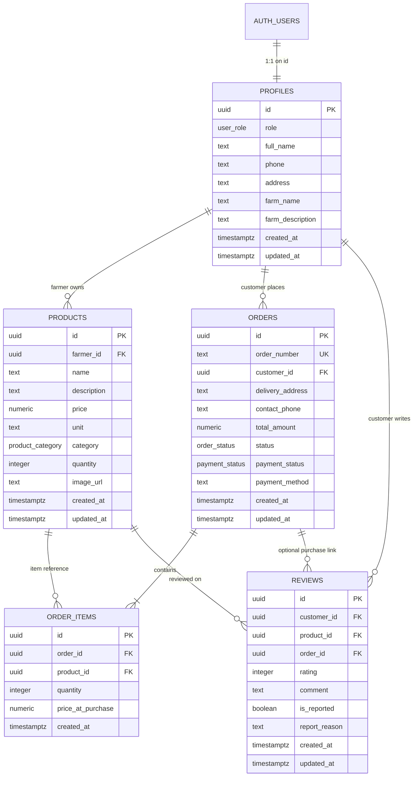

# FarmFresh Database & Supabase Architecture

This document describes the PostgreSQL database architecture, Supabase integration, security policies, and environment setup for FarmFresh.

---

## 1. Architecture Overview

FarmFresh uses PostgreSQL hosted on **Supabase** with Row Level Security (RLS) for data integrity and role-based access control.



---

## 2. Table Specifications & Purposes

### `public.profiles`
- **Purpose**: Stores user profile information and role assignments linked to Supabase Auth (`auth.users.id`).
- **Roles**:
  - `customer`: Can browse products, manage cart, place orders, write reviews.
  - `farmer`: Can manage farm inventory, review incoming orders, update delivery tracking.
  - `admin`: Platform supervisor with moderation and operational monitoring access.
- **Triggers**:
  - `on_auth_user_created`: Automatically inserts a profile row when a user signs up.
  - `tr_profiles_updated_at`: Auto-updates `updated_at`.

### `public.products`
- **Purpose**: Agricultural product listings published by farmers.
- **Key Constraints**:
  - `price >= 0` (prevent negative prices).
  - `quantity >= 0` (prevent negative inventory counts).
  - Category must be one of: `'Vegetables'`, `'Fruits'`, `'Dairy & Eggs'`, `'Honey & Preserves'`.

### `public.orders` & `public.order_items`
- **Purpose**: Normalized multi-item checkout order structure.
- **Historical Price Protection**: `order_items.price_at_purchase` freezes the product price at moment of purchase, protecting historical order accounting against future product price modifications.
- **Status Lifecycle**:
  - `order_status`: `'pending'` → `'in_transit'` → `'delivered'` (or `'cancelled'`).
  - `payment_status`: `'pending'` → `'paid'` (or `'failed'`, `'refunded'`).

### `public.reviews`
- **Purpose**: Product feedback submitted by customers with 1–5 star ratings and moderation flagging.
- **Constraints**: `rating BETWEEN 1 AND 5`.

---

## 3. Row Level Security (RLS) & Role Model

Row Level Security is enabled on **all public tables**:

| Table | SELECT | INSERT | UPDATE | DELETE |
| :--- | :--- | :--- | :--- | :--- |
| **`profiles`** | Public (all) | Own profile only (`auth.uid() = id`) | Own profile only or Admin | Admin only |
| **`products`** | Public (all) | Farmers & Admin | Farmer (own products) or Admin | Farmer (own products) or Admin |
| **`orders`** | Customer (own), Farmer (relevant), Admin | Customers (own) | Farmer (status updates) or Admin | Admin only |
| **`order_items`** | Customer (own order), Farmer (sold items), Admin | Customer (own order) | Admin only | Admin only |
| **`reviews`** | Public (all) | Customers | Customer (own) or Admin | Customer (own) or Admin |

### Security Definer Helpers
- `public.is_admin(user_uid)`: Runs with elevated security definer rights to check if `user_uid` possesses the `'admin'` role in `profiles`, preventing recursive RLS evaluation loops.

---

## 4. Environment Variables

### Frontend (`frontend/.env`)
```bash
VITE_SUPABASE_URL=https://your-project-id.supabase.co
VITE_SUPABASE_ANON_KEY=your-anon-key
VITE_API_URL=http://localhost:5000
```

### Backend (`backend/.env`)
```bash
PORT=5000
NODE_ENV=development
CLIENT_ORIGIN=http://localhost:5173
SUPABASE_URL=https://your-project-id.supabase.co
SUPABASE_SERVICE_ROLE_KEY=your-service-role-key # KEEP SECRET! Server-side only.
```

---

## 5. Applying Migrations

### Option A: Via Supabase CLI (Local Development)
```bash
# 1. Start local Supabase containers
npx supabase start

# 2. Apply migrations
npx supabase migration up

# 3. Seed database
npx supabase db reset
```

### Option B: Via Supabase Web Dashboard (Hosted Project)
1. Open your Supabase Project Dashboard → **SQL Editor**.
2. Run [`supabase/migrations/20260815000001_initial_schema.sql`](file:///c:/Users/Karthik%20T/FarmFresh/FarmFresh/supabase/migrations/20260815000001_initial_schema.sql).
3. Run [`supabase/migrations/20260815000002_row_level_security.sql`](file:///c:/Users/Karthik%20T/FarmFresh/FarmFresh/supabase/migrations/20260815000002_row_level_security.sql).
4. Run [`supabase/seed.sql`](file:///c:/Users/Karthik%20T/FarmFresh/FarmFresh/supabase/seed.sql) (optional development seed).

---

## 6. Local Development Workflow

```bash
# Terminal 1: Backend
cd backend
npm install
npm run dev

# Terminal 2: Frontend
cd frontend
npm install
npm run dev
```
